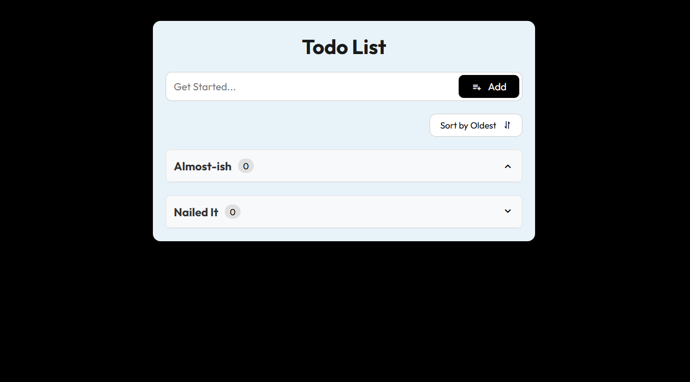

# To-do-List App 📝

A simple and interactive To-do-List application built using **HTML**, **CSS**, and **JavaScript**. This project helps you manage your tasks efficiently with a clean and user-friendly interface.

 <!-- Add a screenshot if you have one -->

## Features ✨
- **Add Tasks**: Easily add new tasks to your list.
- **Mark as Completed**: Check off tasks when they're done.
- **Delete Tasks**: Remove tasks you no longer need.
- **Responsive Design**: Works seamlessly on desktop, tablet, and mobile devices.
- **Local Storage**: Your tasks are saved in the browser, so they persist even after refreshing the page.

## How to Use �
1. **Add a Task**: Type your task in the input field and press "Add" or hit `Enter`.
2. **Complete a Task**: Click the button next to a task to mark it as completed.
3. **Delete a Task**: Click the trash icon to remove a task from the list.

## Installation 🛠️
To run this project locally, follow these steps:

1. **Clone the repository**:
   ```bash
   git clone https://github.com/SoniReddyMaram/To-do-List.git
2. **Navigate to the project directory**:
   - cd To-do-List
3. **Open the Project**:
   - Open the index.html file in your browser.
   - Alternatively, use a live server extension in your code editor (e.g., VS Code) to run the project.

## Technologies Used 💻
- **HTML**: For structuring the application.
- **CSS**: For styling and making the app visually appealing.
- **JavaScript**: For adding interactivity and functionality.

## Folder Structure 📂

- To-do-List/
  - index.html
  - script.js
  - style.css
  - README.md
  - screenshot.png

## Contributing 🤝
Contributions are welcome! If you have any suggestions, bug fixes, or improvements, feel free to open an issue or submit a pull request.

1. Fork the repository.
2. Create a new branch (git checkout -b feature/YourFeatureName).
3. Commit your changes (git commit -m 'Add some feature').
4. Push to the branch (git push origin feature/YourFeatureName).
5. Open a pull request.

## Acknowledgments 🙏
- Inspired by various To-Do List tutorials and projects.
- Thanks to Font Awesome for the icons.

Made with ❤️ by SoniReddyMaram. Happy coding! 🚀
   
